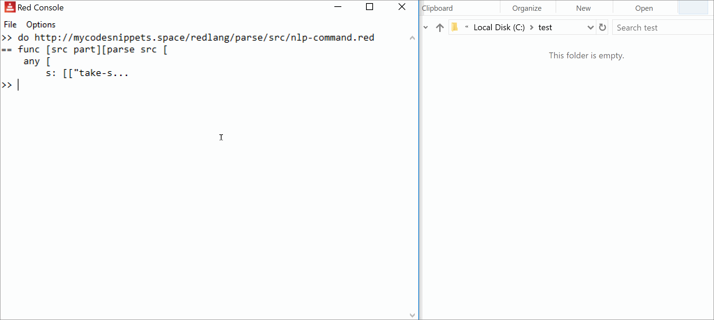

# nlp-command


### ReAdABLE Source [(What is the ReAdABLE Human Format?)](http://readablehumanformat.com)

[http://mycodesnippets.space/redlang/parse/nlp-command.red](https://github.com/lepinekong/mycodesnippets/blob/master/redlang/parse/nlp-command.red)


### Demo

Type in [red-lang](https://www.red-lang.org/p/download.html) console: 
>do http://mycodesnippets.space/redlang/parse/src/nlp-command.red

then:
>take a web screenshot of https://google.com in c:\test\test.1.png
make a screen shot of https://google.com in c:\test\test.2.png
shoot https://google.com c:\test\test.3.png



                    

### Code Snippet


                    
- [View source](https://github.com/lepinekong/mycodesnippets/blob/master/redlang/parse/src/nlp-command.red)
                        
- [Copy source](https://raw.githubusercontent.com/lepinekong/mycodesnippets/master/redlang/parse/src/nlp-command.red)
                        


```redcode

do https://redlang.red/chrome/take-screenshot.red

system/lexer/pre-load: func [src part][
    parse src [
        any [
            s: [
["take-screenshot:" | "take-screenshot." | "Usage: take-screenshot" | "sysTake-Screenshot" | ":take-screenshot"] 
            ] skip
            |
            s: [
[   [
        "take-screenshot" | "make-screenshot"
        |
        ["takescreenshot" | 
        ["take" | "make" | "do" | "create"] 
        some space ["a" some space |] ["web" any space |]
        "screen" any space "shot"
        ]
        | "shoot"
        | "screenshot" 
        | "screencopy" 
        | "webscreenshot" 
    ] [ some space "of" | ]  some space copy arg1 to some space 
    [ some space "in" some space | some space "to" some space | some space ] 
    copy arg2 [to newline | to end ]
] (new: rejoin ["take-screenshot" { } arg1 { } arg2] )
            ] e: (s: change/part s new e) :s            
            | skip
        ]
    ]
]

; testing in console type for example:
; take a web screenshot of https://google.com in c:\test\test.png
; make a screen shot of https://google.com in c:\test\test.png
; shoot https://google.com c:\test\test.png

; testing in script:
; do {
;     take a web screenshot of https://google.com in c:\test\test.1.png
;     make a screen shot of https://google.com in c:\test\test.2.png
;     shoot https://google.com c:\test\test.3.png
; }

        
```


